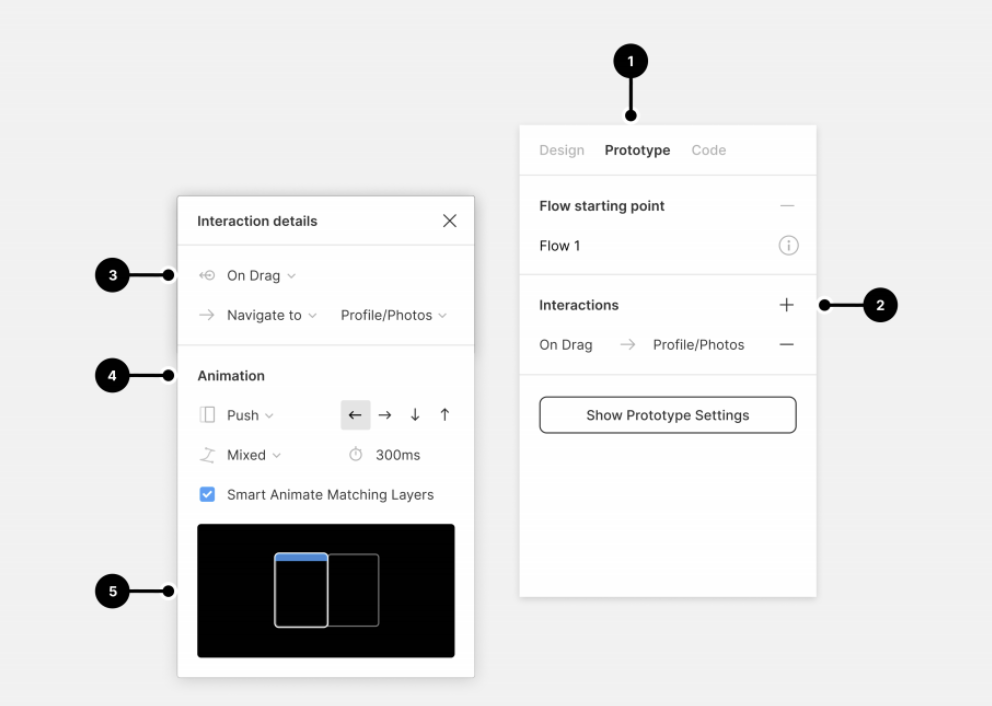
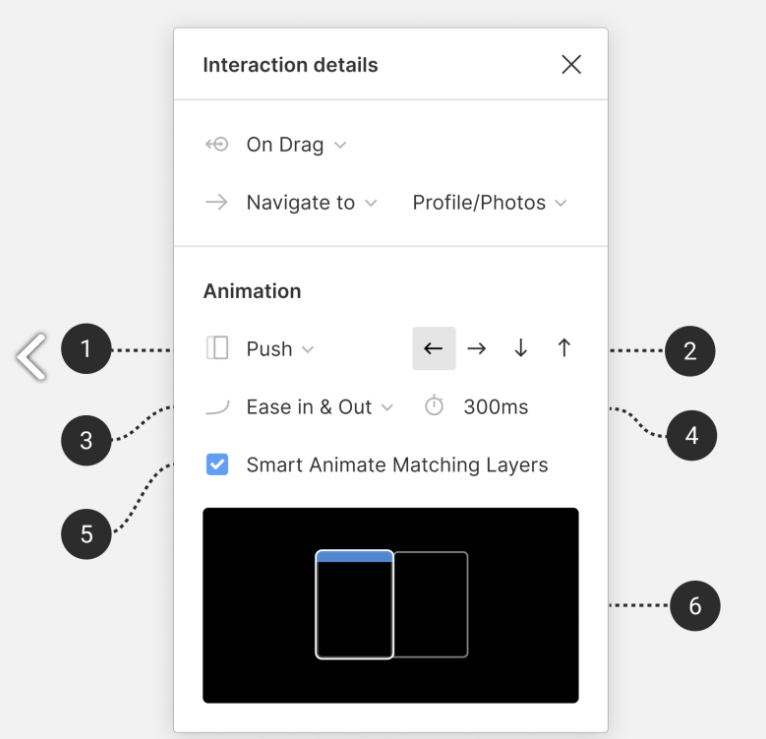

# 피그마 프로토타입
### 프로토타입이란?
- ui/ux에 모션을 넣는 것

1. 프로토타입 선택
2. 인터랙션: 클릭과 드래그같은 입력 요소
3. 트리거: 클릭, 드래그. 마우스 호버같은 트리거 종류 선택
    액션 종료 프레임: 프레임이 어떻게 바뀌고 끝나는지 선택
4. 애니메이션 레이어 움직임
5. 에니메이션 미리 보기

1. 전환 유형 선택
2. 애니메이션 나오는 방향
3. 이징 조정
4. 지속시간 설정
5. 일치하는 레이어를 스마트애니메이션 할지 선택
6. 애니메이션 미리 보기

### 애니메이션
1. instant: 애니메이션 없이 바로 넘어감
2. dissolve: 앞 프레임의 투명도가 0%가돼 넘어감
3. smart animate: move 애니메이션은 연결이 되어야함, a, b가 있을떄 b가 넘어옴
4. move in: a, b가 있을때 b가 슬라이드 처럼 들어옴
5. move out: a, b가 있을떄 b가 슬라이드 처럼 나감
6. push: a, b가 있을때 b프레임이 밀려 나감
7. slide in: a가 투명도가 0%가 되서 b로 넘어감
8. slide out: b의 투명도가 0%에서 100%으로 변해서 나감

### trigger
1. none: 액션 없이 바로 넘김
2. on click/on tap: 클릭, 텝 (가장 대표적 액션)
3. whlie hovering: 마우스가 컴포넌트 위에 위치할때
4. whlie pressing: 마우스가 누르는 동안
5. mouse enter: 마우스가 영역에 들어가는 순간
6. mouse leave: 마우스가 영역에 벗어나는 순간
7. mouse up/touch press: 터치 누르기
8. mouse down/touch relaese: 터치 해제
9. after delay: 일정 시간이 지나면 화면을 벗어남

### action
1. navigate to: 연결한 프레임으로 이동
2. change to: 베리언트 내에 연결할때 해당 컨포넌트 변경
3. open overlay: 오버레이 열림
4. swap overlay: 오버레이 프레임으로 변경
5. close overlay: 오버레이 닫기
6. back: 맨 처음 프레임으로 이동
7. scroll to: 연결한 위치로 스크롤
8. open URL: 외부 링크로 연결